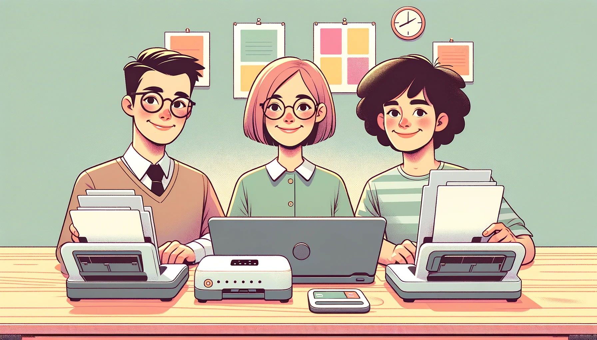

In this project we're taking a hypothetical scenario where an insurance company has a new initiative which is to digitalize all historical insurance claim documents, which includes improving the labeling of some IDs scanned from paper documents and identifying them as primary or secondary IDs.

To help them in their effort, I've used multi-modal learning to train an Optical Character Recognition (OCR) model. To improve the classification, the model will use **images** of the scanned documents as input and their **insurance type** (home, life, auto, health, or other). 

Integrating different data modalities (such as image and text) enables the model to perform better in complex scenarios, helping to capture more nuanced information. 

The **labels** that the model will be trained to identify are of two types: a primary and a secondary ID, for each image-insurance type pair.

To have a look at my code, open the `notebook.ipynb` file!